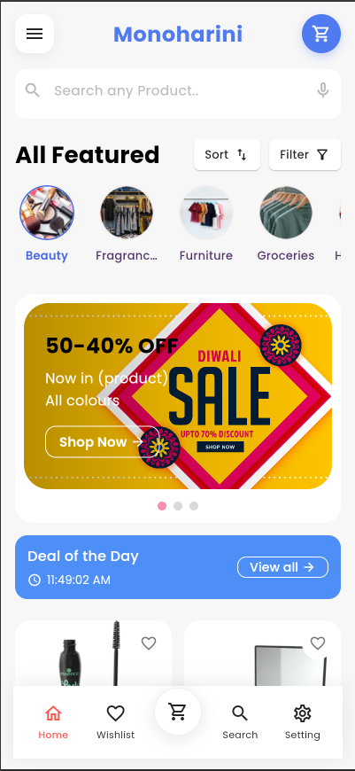
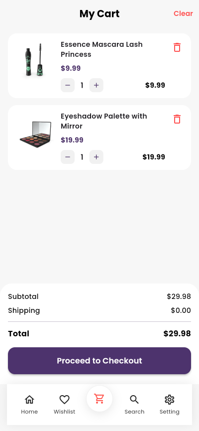
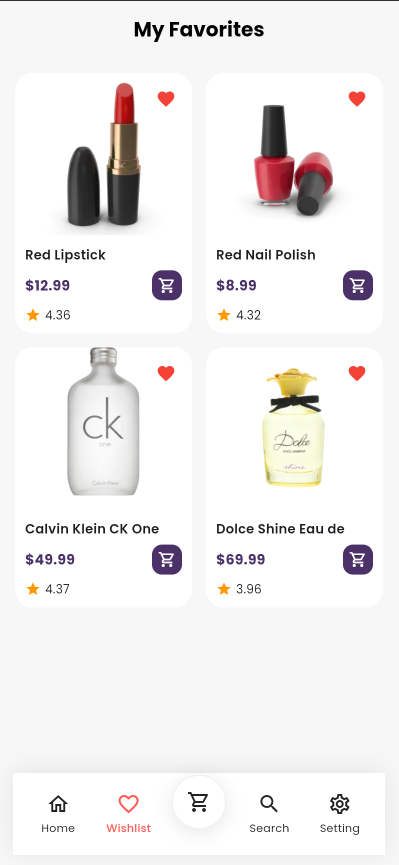
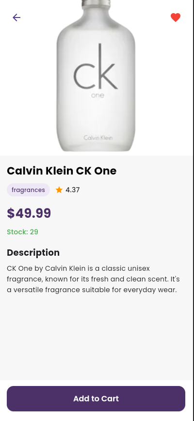

# Monoharini E-Commerce App 🛍️

A modern, clean, and responsive e-commerce mobile application built using **Flutter** and managed with **Riverpod** for robust state management. The app delivers a seamless shopping experience featuring category browsing, daily deals, real-time cart handling, favorites tracking, and intuitive user profiles.

---

## 📱 Features

* **Dynamic Home Dashboard:** Features promotional banners, horizontal category quick-links, and daily flash sales.
* **State-Driven Cart Management:** Real-time item additions, subtotals, and automatic checkout breakdowns powered cleanly by Riverpod.
* **Favorites System:** Save preferred beauty, fragrance, and lifestyle products to a dedicated wishlist grid.
* **Detailed Product Overviews:** Clean typography showcasing item imagery, descriptions, pricing tiers, and direct-to-cart actions.
* **Profile & Identity Hub:** Secure client forms to handle account authentication, email changes, and shipping addresses.

---

## 🎨 App Screenshots

| Home Dashboard | Shopping Cart | Wishlist |
| :---: | :---: | :---: |
|  |  |  |

| Product Details | User Profile |
| :---: | :---: |
|  |  |

---

## 🛠️ Architecture & Tech Stack

* **Framework:** [Flutter](https://flutter.dev/) (Dart)
* **State Management:** [Flutter Riverpod](https://riverpod.dev/) (Compile-safe, decoupled state tracking)
* **Typography:** Poppins & custom geometric Sans-Serif fonts
* **Icons:** Material Design Icons & Cupertino Icons
